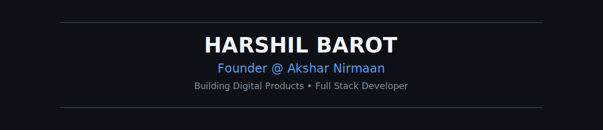

<!-- =============================== -->
<!--           HERO SECTION           -->
<!-- =============================== -->

<p align="center">
  
</p>

<h1 align="center">Harshil Barot</h1>

<p align="center">
<b>Founder @ Akshar Nirmaan</b><br>
Building Digital Products • Full Stack Developer
</p>

<p align="center">

<a href="https://www.linkedin.com/in/harshil-barot-211513353">

</a>

&nbsp;&nbsp;&nbsp;

<a href="mailto:contact.aksharnirmaan@gmail.com">

</a>

&nbsp;&nbsp;&nbsp;

<a href="https://github.com/Harshil0265">

</a>

</p>

<p align="center">

</p>

<!-- =============================== -->
<!--       TERMINAL SECTION          -->
<!-- =============================== -->

<p align="center">

</p>

```text
harshil@aksharnirmaan:~$ fastfetch

██████████████████████████████████
█                                █
█       ASCII Portrait           █
█       Coming in Phase 2        █
█                                █
██████████████████████████████████

Name        Harshil Barot

Role        Founder & Developer

Company     Akshar Nirmaan

Location    Vadodara, Gujarat, India

Mission     Building Digital Products

Stack       Next.js
            React
            Node.js
            Express
            MongoDB

Languages   JavaScript
            Python
            Java
            C++

Status      Building • Learning • Shipping
```

<p align="center">

</p>

## About

Founder of **Akshar Nirmaan**, focused on helping businesses build modern digital products.

Currently working with:

- Full Stack Development
- Business Websites
- SaaS Products
- AI Integrations
- UI / UX

<p align="center">

</p>

## Featured Projects

🚧 Coming Soon...

<p align="center">

</p>

## GitHub Analytics

🚧 Coming Soon...
